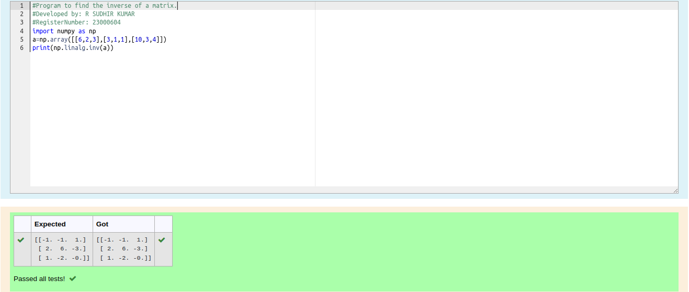

# INVERSE-OF-A-MATRIX
## Aim:
To write a python program to find the inverse of a matrix
## Equipment’s required:
1. 	Hardware – PCs
2. 	Anaconda – Python 3.7 Installation / Moodle-Code Runner
## Algorithm:
### Step1 : 
Import the module
### Step 2: 
Assign as an array for the given matrix
### Step 3:
Using linalg.inv from numpy module find the inverse of the matrix 
### Step 4: 
End the program

## Program:
```python
#Program to find the inverse of a matrix.
#Developed by: R SUDHIR KUMAR
#RegisterNumber: 23000604
import numpy as np
a=np.array([[6,2,3],[3,1,1],[10,3,4]])
print(np.linalg.inv(a))
```
## Output:

## Result:
Thus the inverse of given matrix is successfully solved using python program

